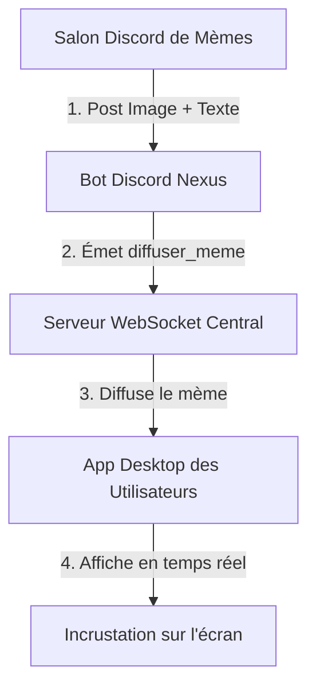

# 🖥️ Spécifications de l'Application Desktop "Meme Overlay"

Ce guide décrit le fonctionnement, l'architecture et les spécifications techniques de la future **Application Desktop Meme Overlay**. Cette application se connecte à votre serveur WebSocket central et affiche instantanément les mèmes envoyés depuis Discord sur l'écran des utilisateurs sous forme d'incrustation (overlay) entièrement personnalisable.

---

## 🛠️ Architecture Globale en Temps Réel



---

## 🌟 Fonctionnalités Principales de l'Application Desktop

L'application Desktop doit être légère et discrète. Elle est composée de deux parties :
1. **La Fenêtre d'Incrustation (Overlay)** : Transparente, affichée au-premier plan, "cliquable à travers" (click-through) pour ne pas gêner le jeu ou le travail de l'utilisateur.
2. **Le Panneau de Configuration** : Permettant de personnaliser l'expérience.

### 1. 🔌 Connexion / Déconnexion
- **Bouton d'état** : Un simple commutateur (Toggle) permettant de se connecter ou de se déconnecter du serveur WebSocket central.
- **Champ URL du Serveur** : Permet à l'utilisateur de renseigner l'adresse du serveur WebSocket (ex: `https://ton-serveur-gratuit.onrender.com`).
- **Indicateur de statut** : Un voyant lumineux de couleur indiquant l'état actuel (🔴 Déconnecté, 🟡 Connexion en cours..., 🟢 Connecté).

### 2. 📍 Emplacement de l'Affichage (Position)
Les utilisateurs doivent pouvoir choisir où le mème apparaîtra sur leur écran pour ne pas masquer des éléments importants (comme le radar d'un jeu ou des barres de tâches) :
- **Préréglages d'affichage** :
  - Haut-Gauche
  - Haut-Droite (Recommandé pour la plupart des configurations)
  - Bas-Gauche
  - Bas-Droite
  - Centre de l'écran


### 3. 📏 Dimensionnement (Grandeur)
- **Ajustement de la taille** : Un curseur (Slider) pour définir la largeur maximale de l'image (ex: de `200px` pour un rendu très discret à `800px` pour un affichage géant).
- **Proportions conservées** : La hauteur s'adapte automatiquement pour éviter toute déformation du mème.

### 4. ⏳ Durée d'Affichage & Animations
- **Temps d'affichage** : Un sélecteur pour choisir le nombre de secondes pendant lesquelles le mème reste affiché (ex: de 3 à 15 secondes, ou affichage permanent jusqu'au clic).
- **Effets de transition** : Entrée en fondu (Fade-in) ou glissement depuis le bord de l'écran (Slide-in), puis disparition en fondu (Fade-out).

### 5. 🔊 Notifications Sonores (Optionnel)
- Possibilité d'activer un léger effet sonore (pop / blip) à l'apparition d'un nouveau mème pour attirer l'attention.

---

## 💻 Choix Techniques Recommandés pour le Développement

Pour concevoir cette application, voici les trois frameworks les plus adaptés :

### Option A : Electron.js (HTML/CSS/JS) — *Recommandé pour débuter*
* **Avantages** : Permet de réutiliser directement vos compétences en développement web. Très facile pour faire des fenêtres transparentes avec style CSS dynamique.
* **Comment faire l'overlay** : Configurer la fenêtre principale avec :
  ```javascript
  const win = new BrowserWindow({
    transparent: true,
    frame: false,
    alwaysOnTop: true,
    hasShadow: false
  });
  win.setIgnoreMouseEvents(true); // Rend la fenêtre invisible aux clics (Click-through)
  ```

### Option B : Tauri (Rust + HTML/CSS/JS) — *Recommandé pour la légèreté*
* **Avantages** : Consomme extrêmement peu de mémoire RAM (15-30 Mo contre 120 Mo+ pour Electron) et produit des exécutables très légers (moins de 10 Mo).

### Option C : Python + PyQt6 / PySide6
* **Avantages** : Simple si vous connaissez déjà Python. Permet de gérer facilement les fenêtres transparentes au premier plan grâce aux drapeaux de fenêtre Qt (`Qt.WindowType.WindowStaysOnTopHint` et `Qt.WindowType.FramelessWindowHint`).

---

## 📡 Protocole WebSocket : Événement attendu

L'application Desktop doit écouter l'événement WebSocket suivant diffusé par votre serveur central :

* **Nom de l'événement** : `diffuser_meme`
* **Format des données reçues (JSON)** :
  ```json
  {
    "url": "https://cdn.discordapp.com/attachments/...",
    "text": "Quand le code compile du premier coup !",
    "author": "Maxou#1337",
    "timestamp": "2026-05-22T21:55:00.000Z"
  }
  ```

---

## 🎨 Maquette Visuelle suggérée de l'Overlay (Sur l'écran du joueur)

```
+-----------------------------------------------------------+
|                                                           |
|                                     [ Auteur: Maxou ]     |
|                                    +-----------------+    |
|                                    |                 |    |
|                                    |   IMAGE DU      |    |
|                                    |    MÈME         |    |
|                                    |                 |    |
|                                    +-----------------+    |
|                                     Quand le code    |
|                                     compile du 1er   |
|                                     coup !           |
|                                                           |
+-----------------------------------------------------------+
```
