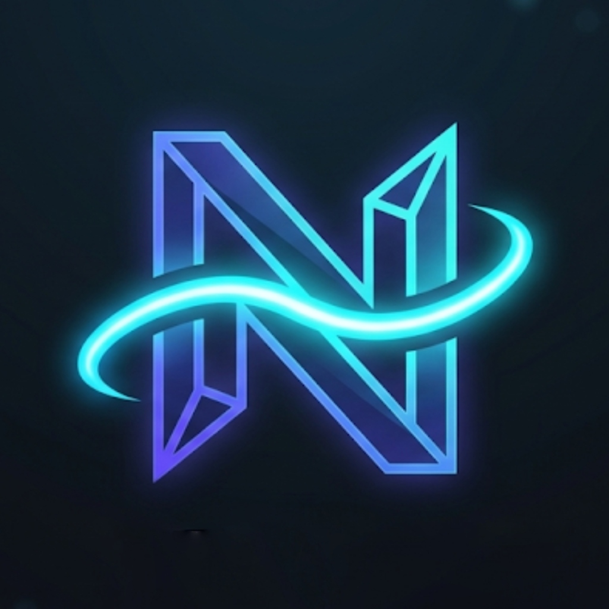

# Nexus Bot

<p align="center">
  
</p>

<h1 align="center">Nexus Bot</h1>

<p align="center">
  <strong>Un bot Discord modulaire comprenant un Dashboard Web interactif, une surveillance YouTube en temps réel, des salons vocaux dynamiques, un système de tickets et un module de divertissement.</strong>
</p>

<p align="center">
  <a href="https://github.com/LeigerMax/Nexus_Discord_Bot/releases"></a>
  
  
  
</p>

<p align="center">
  🌐 <strong><a href="README.md">English Version here</a></strong>
</p>

---

> [!NOTE]
> 🌐 **Nexus Dashboard** : Configurez entièrement toutes les fonctionnalités du bot (YouTube, Statistiques, Salons Vocaux Temporaires) instantanément et en temps réel via une interface web de qualité, sans saisir une seule ligne de commande !

**Nexus Bot** est un outil d'automatisation tout-en-un pour Discord. Équipé d'un **Dashboard Web** propulsé par Express et l'authentification OAuth2 de Discord, il permet aux administrateurs de gérers les notifications, les statistiques et le système d'assistance en temps réel. Il sert également d'émetteur WebSocket central (Socket.io) pour l'application de bureau **Nexus Overlay**: [GitHub Nexus-Overlay](https://github.com/LeigerMax/Nexus-Overlay), permettant d'afficher instantanément les mèmes partagés sur Discord directement sur l'écran des utilisateurs.

---

## 🔮 Fonctionnalités Clés

* **📺 Système YouTube ** : Surveillance ultra-stable de plusieurs chaînes YouTube avec résolution automatique des handles (`@chaine`), annonces personnalisables pour chaque chaîne et système de mise en cache robuste pour éviter les doublons.
* **📊 Statistiques du Serveur en Direct** : Affichage dynamique de vos métriques clés (membres totaux et membres en ligne) dans les salons vocaux, utilisant une mise en cache de l'API REST pour éviter les limites de requêtes (rate limits) de la Gateway Discord.
* **🎙️ Salons Vocaux Temporaires** : Gestionnaire dynamique de salons vocaux (Auto-Channels). Rejoindre le salon "Hub" crée instantanément un salon vocal privé avec des permissions personnalisables, qui est automatiquement supprimé dès qu'il est vide.
* **🎫 Système de Support par Tickets** : Panneau d'assistance sécurisé doté de boutons interactifs. Génère des salons privés visibles uniquement par l'auteur du ticket et l'équipe du Staff, avec catégorisation dédiée.
* **💾 Stockage Discord-as-a-DB** : Base de données légère et autonome. Les configurations sont sauvegardées sous forme de **fichiers JSON en pièces jointes** dans un salon privé Discord, contournant la limite des 2000 caractères sans nécessiter de base de données externe.
* **🎮 Système de Divertissement et Malédictions** : Plus de 30 commandes interactives (roulette, mini-jeux) et un système complet de malédictions (`!curse`) contenant 21 malédictions uniques (mode UwU, langage de Yoda, mode clown, mute vocal forcé, déformeur de messages).
* **🌐 Dashboard Web** : Panneau de configuration intégrant l'authentification Discord OAuth2, des onglets de configuration en temps réel, des icônes SVG et un design adaptatif.
* **❓ Aide Intégrée** : Tapez `!help` directement dans n'importe quel salon Discord pour obtenir instantanément la liste complète des commandes disponibles.

---

## 📂 Structure du Projet

```text
Nexus_Discord_Bot/
├── docs/                  # Documentation du projet (Guides et charte graphique)
├── src/
│   ├── bot.js             # Point d'entrée principal (chargement de la config, des événements et des serveurs Express/Socket.io)
│   ├── commands/          # Commandes du bot Discord (slash & préfixes)
│   │   ├── admin/         # Modules d'administration (configuration, setup)
│   │   ├── fun/           # Interactions amusantes et déclencheurs de malédictions
│   │   ├── games/         # Jeux et divertissement (roulette russe, pile ou face, dés)
│   │   └── general/       # Utilitaires d'aide, de support et de statut
│   ├── config/            # Fichiers de configuration locale
│   │   ├── botConfig.json # Structure JSON définissant la configuration des modules
│   │   └── version.json   # Catalogue des versions et journal des modifications
│   ├── events/            # Écouteurs d'événements Discord.js (messageCreate, ready)
│   ├── middlewares/       # Filtres de sécurité et sessions pour le Dashboard Express
│   ├── public/            # Client Frontend du Dashboard Web
│   │   ├── index.html     # Page de connexion du Dashboard (OAuth2 Discord)
│   │   ├── dashboard.html # Gestionnaire des onglets (YouTube, Anti-Raid, Stats)
│   │   ├── style.css      # Design moderne et sombre (variables, dégradés, Glassmorphism)
│   │   └── logo.jpg       # Identité visuelle du projet
│   ├── services/          # Services d'arrière-plan (stockage, mises à jour, statistiques)
│   │   ├── auditService.js # Système de journalisation des actions
│   │   ├── keepAlive.js   # Serveur Web Express et gestionnaire WebSocket Socket.io
│   │   ├── statsService.js# Agrégateur de compteurs pour l'API REST
│   │   ├── storageService.js # Base de données par fichiers joints (Discord-as-a-DB)
│   │   └── youtubeService.js # Observateur de flux YouTube avec cache
│   └── utils/             # Helper libraries and functional utilities
├── .env                   # Variables d'environnement locales
├── package.json           # Scripts de gestion, dépendances et configurations du bot
└── README.md              # Documentation principale en anglais pointant vers les sous-documents
```

---

## 🛠️ Installation Locale & Développement

### Prérequis
* [Node.js](https://nodejs.org/) (Version 18+ recommandée)
* [Git](https://git-scm.com/)

### Étape 1 : Cloner le dépôt
```bash
git clone https://github.com/LeigerMax/Nexus_Discord_Bot.git
cd Nexus_Discord_Bot
```

### Étape 2 : Installer les dépendances
```bash
npm install
```

### Étape 3 : Configurer les variables d'environnement
Créez un fichier `.env` à la racine du projet avec les clés suivantes :
```env
DISCORD_TOKEN=votre_token_bot
STORAGE_CHANNEL_ID=id_du_salon_prive_de_stockage
DISCORD_CLIENT_ID=id_client_du_bot
DISCORD_CLIENT_SECRET=secret_client_du_bot
DISCORD_REDIRECT_URI=http://localhost:10000/auth/callback
SESSION_SECRET=votre_cle_de_session_aleatoire
PORT=10000
```

### Étape 4 : Lancer le bot en mode développement
```bash
npm run dev
```

### Étape 5 : Lancer les tests automatisés
```bash
npm run test
```

---

## 📝 Licence
Ce projet est sous licence **MIT**. Voir le fichier de licence pour plus de détails.

---

## 🔗 Contact & Liens
* **Développeur** : [LeigerMax (Allmaxou)](https://github.com/LeigerMax/)
* **Bot Discord Officiel** : [GitHub Nexus_Discord_Bot](https://github.com/LeigerMax/Nexus_Discord_Bot)
* **Dépôt de l'App Desktop** : [GitHub Nexus-Overlay](https://github.com/LeigerMax/Nexus-Overlay)
